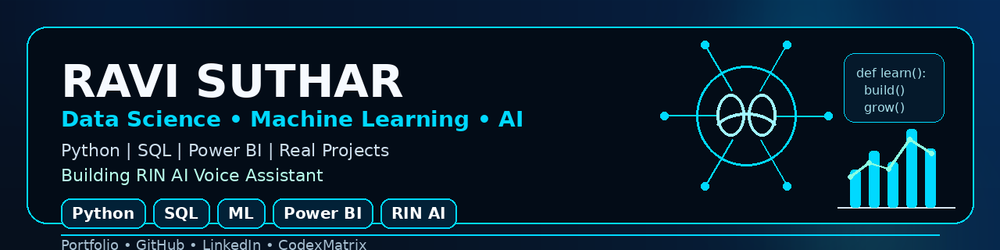

  

 

---

## 🧠 About Me

I am a Data Science fresher from India, learning and building real-world projects in Data Analytics, Machine Learning, and AI.

- 🌱 Currently learning **Python, SQL, Machine Learning, Power BI**
- 🤖 Building **RIN AI Voice Assistant**
- 📊 Interested in **Data Analytics, AI, ML, and Automation**
- 🚀 Goal: Become a skilled Data Analyst / Data Scientist
- 🌐 Portfolio: **https://ravisuthar-13.github.io/ravi-portfolio/**

---

## 🛠️ Tech Stack

  

  
  
  
  

---

## 🚀 Featured Projects

| Project | Description |
|---|---|
| 🌾 **Crop Yield Prediction** | Machine Learning + SQL based crop prediction project |
| 🛒 **Ecommerce Sales Analysis** | Data analysis project for ecommerce sales insights |
| 🏠 **Home Price Prediction** | Machine Learning project for price prediction |
| 📊 **Customer Shopping Behavior Analysis** | Customer insights and purchase pattern analysis |
| 🤖 **RIN AI Voice Assistant** | Personal AI voice assistant built using Python |

---

## 🤖 RIN AI Voice Assistant

RIN is my personal AI voice assistant project.  
It can listen, respond, open apps, answer questions, and will grow step by step with more AI features.

---

## 📊 GitHub Stats

  

  

  

---

## 🌐 Connect with Me

  
  

---

  ⭐ Thanks for visiting my GitHub profile!

